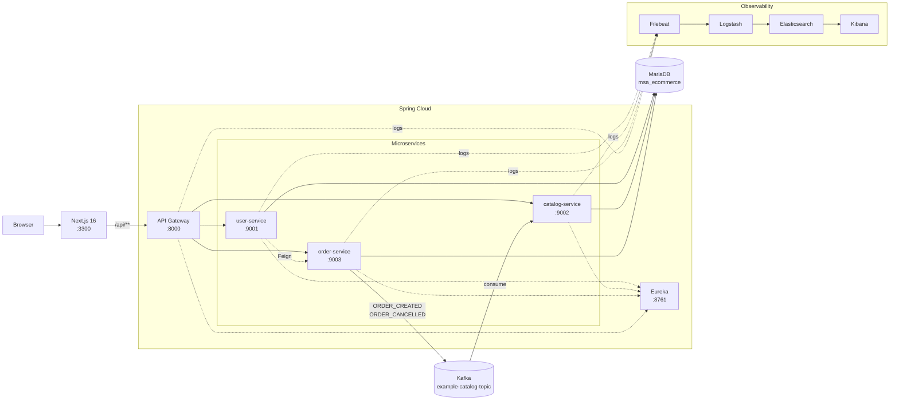
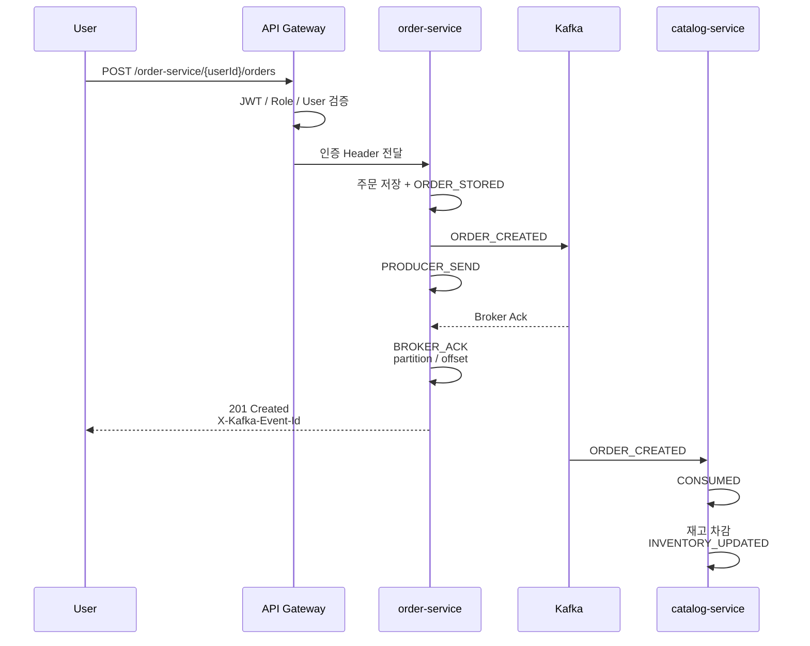

# MSA Market Platform

Spring Cloud 기반 마이크로서비스 E-Commerce 플랫폼입니다.

단순히 주문/상품 기능을 구현하는 데서 끝내지 않고, **Kafka 이벤트가 Producer → Broker → Consumer → 재고 반영까지 어느 단계에서 처리되고 있는지 화면에서 추적**할 수 있도록 확장한 프로젝트입니다.

`Java 11` `Spring Boot 2.4.2` `Spring Cloud 2020.0` `Kafka` `MariaDB` `Next.js 16` `Docker Compose` `ELK`

---

## 프로젝트 출처와 범위

이 프로젝트는 이도원 강사님의 인프런 강의  
**Spring Cloud로 개발하는 마이크로서비스 애플리케이션(MSA)** 예제 코드를 학습 출발점으로 사용했습니다.

- Original Repository: [joneconsulting/msa_with_spring_cloud](https://github.com/joneconsulting/msa_with_spring_cloud)

강의 예제를 그대로 재사용한 포트폴리오가 아니라, 기존 코드를 분석한 뒤 다음 기능을 직접 설계하고 확장했습니다.

| 영역 | 강의 예제 기반 | 현재 프로젝트 확장 |
|---|---|---|
| 데이터 | H2 인메모리 DB | **MariaDB 영속화**, 초기 데이터 시딩 |
| 인증 | JWT 발급/검증 | **Role 기반 인증/인가**, Gateway Route 권한 분리 |
| 사용자 권한 | 토큰 유효성 중심 | `ROLE_USER`, `ROLE_ADMIN`, 본인 소유권 검증 |
| Kafka | 주문 → 재고 차감 | **Event ID 기반 처리 단계 추적**, 취소 보상 이벤트 |
| 재고 | 주문 시 감소 | 주문 취소 시 **ORDER_CANCELLED → 재고 복원** |
| 관측 | 기본 로그 | **Kafka Event Flow Monitor**, System Monitor |
| 로그 | 서비스별 콘솔 | **ELK 중앙 로그 수집 1차 구성** |
| 화면 | 별도 UI 없음 | **Next.js 16 App Router 사용자/관리자 UI** |
| 실행 | 서비스 개별 실행 | **전체 Docker Compose 실행 구성 + IntelliJ 개발 모드 병행** |

> 현재 저장소에는 강의 실습 과정에서 사용했던 일부 레거시 모듈과 설정이 남아 있습니다. 기능 안정화 후 단계적으로 정리할 예정입니다.

---

# Architecture



### 핵심 설계

- 외부 요청은 **API Gateway 단일 진입점**을 사용합니다.
- 서비스 위치는 **Eureka Service Discovery**로 조회합니다.
- Gateway는 `lb://SERVICE-NAME` 방식으로 각 서비스에 라우팅합니다.
- 주문과 재고는 직접 동기 호출하지 않고 **Kafka 이벤트 기반 비동기 처리**를 사용합니다.
- Gateway가 인증 사용자 정보를 검증한 뒤 `X-Auth-User-Id`, `X-Auth-User-Role` 헤더를 다시 생성해 하위 서비스로 전달합니다.
- 하위 서비스에서도 사용자 소유권을 다시 검증해 **본인 또는 관리자만 접근**하도록 구성했습니다.

---

# Core Flow

## 주문 생성 → Kafka → 재고 차감



Kafka 처리 단계:

```text
ORDER_STORED
    ↓
PRODUCER_SEND
    ↓
BROKER_ACK
    ↓
CONSUMED
    ↓
INVENTORY_UPDATED
```

---

## 주문 취소 → Kafka 보상 이벤트 → 재고 복원

관리자가 주문을 취소하면 단순 DB 삭제로 끝내지 않고 Kafka 보상 이벤트를 발생시킵니다.

```text
ORDER_DELETED
    ↓
PRODUCER_SEND
    ↓
BROKER_ACK
    ↓
CONSUMED
    ↓
INVENTORY_RESTORED
```

Event Type:

```text
ORDER_CANCELLED
```

Catalog Consumer가 취소 수량을 다시 더해 재고를 복원합니다.

---

# Kafka Event Flow Monitor

비동기 시스템은 요청 자체가 성공하더라도 실제 Consumer 처리까지 정상 완료됐는지 확인하기 어렵습니다.

이를 확인하기 위해 `eventId` 단위로 다음 정보를 저장합니다.

```text
eventId
eventType
stage
topic
partition
offset
messageKey
consumerGroup
orderId
productId
beforeStock
afterStock
payload
status
createdAt
errorMessage
```

화면에서는 최근 Kafka Event를 선택해 과거 처리 흐름도 다시 확인할 수 있습니다.

```text
최근 Kafka Event 클릭
        ↓
eventId 선택
        ↓
Topic / Partition / Offset 변경
        ↓
Event Timeline 변경
        ↓
Kafka JSON Payload 변경
```

재고 부족, 상품 없음 등의 Consumer 처리 오류는 `CONSUMER_ERROR`로 기록해 원인을 확인할 수 있도록 했습니다.

---

# Authentication / Authorization

로그인 성공 시 JWT를 발급합니다.

JWT 주요 정보:

```text
subject = userId
role    = ROLE_USER / ROLE_ADMIN
```

Gateway는 요청 경로별로 JWT와 Role을 검증합니다.

검증된 사용자 정보는 클라이언트가 임의로 조작할 수 없도록 기존 Header를 제거한 뒤 Gateway가 다시 생성합니다.

```text
X-Auth-User-Id
X-Auth-User-Role
```

### 주요 권한

| Endpoint | 권한 |
|---|---|
| `POST /user-service/login` | 공개 |
| `POST /user-service/users` | 공개 |
| `GET /catalog-service/catalogs` | 공개 |
| `GET /catalog-service/kafka/events` | 공개 |
| `POST /order-service/{userId}/orders` | 로그인 + 본인 또는 관리자 |
| `GET /order-service/{userId}/orders` | 로그인 + 본인 또는 관리자 |
| `GET /user-service/users` | `ROLE_ADMIN` |
| `PUT /user-service/users/**` | `ROLE_ADMIN` |
| `DELETE /user-service/users/**` | `ROLE_ADMIN` |
| `POST /catalog-service/catalogs/**` | `ROLE_ADMIN` |
| `PUT /catalog-service/catalogs/**` | `ROLE_ADMIN` |
| `DELETE /catalog-service/catalogs/**` | `ROLE_ADMIN` |
| `GET /order-service/orders` | `ROLE_ADMIN` |
| `DELETE /order-service/orders/**` | `ROLE_ADMIN` |

회원가입 요청에서 Role을 넘기더라도 서버에서 강제로:

```text
ROLE_USER
```

로 설정합니다.

`user-service → order-service` Feign 조회는 외부 Gateway Route에 노출하지 않는 내부 Endpoint를 사용합니다.

```text
/order-service/internal/{userId}/orders
```

---

# UI

현재 주요 화면:

```text
쇼핑몰
├─ 메인
├─ 상품
├─ 장바구니
└─ 주문내역

관리자
├─ Dashboard
├─ 사용자 관리
├─ 상품 관리
└─ 주문 관리

System Monitor
├─ Kafka Live Flow
└─ Service 상태
```

스크린샷은 추후 `docs/` 디렉터리에 추가할 예정입니다.

예정 파일:

```text
docs/
├─ screenshot-store.png
├─ screenshot-kafka.png
├─ screenshot-admin.png
└─ screenshot-system-monitor.png
```

---

# Run Mode

현재 프로젝트는 두 가지 실행 방식을 지원하도록 구성합니다.

## 1. Full Docker Mode

통합 테스트 / 시연 / 포트폴리오 실행용입니다.

```powershell
cd D:\SpringCloud

docker compose -f docker-compose.full.yml up -d --build
```

주요 Container:

```text
msa-mariadb
msa-zookeeper
msa-kafka
msa-discoveryservice
msa-user-service
msa-catalog-service
msa-order-service
msa-apigateway-service
msa-frontend
msa-elasticsearch
msa-logstash
msa-filebeat
msa-kibana
```

> 전체 Docker Compose 구성은 적용되어 있으며 현재 최종 통합 기동/Healthcheck 검증을 진행 중입니다.

상태 확인:

```powershell
docker compose -f docker-compose.full.yml ps
```

종료:

```powershell
docker compose -f docker-compose.full.yml down
```

일반적인 종료 시에는 DB/Elasticsearch 데이터를 보호하기 위해 `down -v`를 사용하지 않습니다.

---

## 2. IntelliJ Development Mode

개발 중에는 다음처럼 사용할 수 있습니다.

```text
Docker
├─ MariaDB
├─ ZooKeeper
├─ Kafka
└─ ELK

IntelliJ
├─ discoveryservice
├─ user-service
├─ catalog-service
├─ order-service
└─ apigateway-service

PowerShell
└─ Next.js
```

Spring 코드를 수정할 때마다 Docker Image를 다시 Build할 필요가 없어 개발에 편리합니다.

### IntelliJ 실행 주소

```text
MariaDB → localhost:3306
Kafka   → localhost:9092
Eureka  → localhost:8761
```

### Docker Container 내부 주소

```text
MariaDB → mariadb:3306
Kafka   → kafka:29092
Eureka  → discoveryservice:8761
```

Spring 설정은 환경변수를 사용해 두 실행 방식을 모두 지원합니다.

---

# Local Development

## Requirements

```text
Windows 11
JDK 11
Docker Desktop
Node.js
IntelliJ IDEA
```

Java 확인:

```powershell
java -version
```

이 프로젝트는 현재:

```text
Java 11
Spring Boot 2.4.2
Spring Cloud 2020.0
```

기준입니다.

JDK 25 등 최신 JDK로 Maven Build 시 기존 Lombok 버전과 Compiler 호환 문제가 발생할 수 있으므로 JDK 11을 사용합니다.

---

## Infrastructure

개발 모드에서는 MariaDB / Kafka / ELK를 Docker로 실행합니다.

Kafka Topic:

```text
example-catalog-topic
```

Kafka Host 접속:

```text
localhost:9092
```

Docker 내부 접속:

```text
kafka:29092
```

---

## Spring Service 실행 순서

개발 모드 권장 순서:

```text
1. MariaDB
2. Kafka / ZooKeeper
3. Eureka
4. User Service
5. Catalog Service
6. Order Service
7. API Gateway
8. Next.js
9. ELK
```

Spring 서비스:

```text
discoveryservice   :8761
user-service       :9001
catalog-service    :9002
order-service      :9003
apigateway-service :8000
```

---

## Next.js

```powershell
cd msa-react-test-ui

npm install
npm run dev
```

Windows 환경에서 `3000` 포트가 예약 범위에 포함될 수 있어 현재 개발 포트는 `3300` 사용을 권장합니다.

```powershell
npx next dev --port 3300
```

접속:

```text
http://localhost:3300
```

Next.js는 `/api/*` 요청을 Gateway로 Rewrite합니다.

```text
Browser
  ↓
/api/*
  ↓
API Gateway :8000
```

---

# Test Account

| 계정 | 비밀번호 | Role |
|---|---|---|
| `admin@test.com` | `admin1234` | `ROLE_ADMIN` |
| `test@test.com` | `test1234` | `ROLE_USER` |

> DB 초기화/Seed 상태에 따라 계정 존재 여부를 확인해야 합니다. 비밀번호는 BCrypt Hash 형태로 저장됩니다.

---

# ELK

로그 수집 구조:

```text
Spring Boot JSON Log
        ↓
Filebeat
        ↓
Logstash
        ↓
Elasticsearch
        ↓
Kibana
```

기본 주소:

```text
Elasticsearch http://localhost:9200
Kibana        http://localhost:5601
Logstash      localhost:5044
```

Index Pattern:

```text
msa-market-logs-*
```

검색 예:

```text
service.name : "order-service"
```

```text
service.name : "catalog-service"
```

```text
message : *Kafka*
```

현재 ELK는 **1차 적용 상태**이며, 전체 Docker 환경에서 최종 통합 로그 수집을 계속 검증하고 있습니다.

---

# Project Structure

```text
.
├─ discoveryservice/
│  └─ Eureka Server
│
├─ apigateway-service/
│  └─ Spring Cloud Gateway / JWT / Role Authorization
│
├─ user-service/
│  └─ 회원 / 로그인 / JWT / Feign
│
├─ catalog-service/
│  └─ 상품 / Kafka Consumer / Kafka Event Log
│
├─ order-service/
│  └─ 주문 / Kafka Producer / Kafka Event Log
│
├─ msa-react-test-ui/
│  └─ Next.js 16 App Router Frontend
│
├─ infrastructure/
│  └─ elk/
│     ├─ Elasticsearch
│     ├─ Logstash
│     ├─ Filebeat
│     └─ Kibana
│
├─ docker-files/
│  └─ 기존 개발용 MariaDB / Kafka Compose
│
├─ docker-compose.full.yml
│  └─ 전체 시스템 Docker Compose
│
├─ MSA_MARKET_PLATFORM_DEVELOPER_GUIDE.md
├─ MSA_MARKET_PLATFORM_DOCKER_INFRASTRUCTURE_GUIDE.md
├─ MSA_MARKET_PLATFORM_FULL_DOCKER_GUIDE.md
└─ README.md
```

---

# Documents

- [개발자 가이드](./MSA_MARKET_PLATFORM_DEVELOPER_GUIDE.md)  
  서비스 구조, 구현 내용, 주요 오류와 해결 과정

- [Docker 인프라 가이드](./MSA_MARKET_PLATFORM_DOCKER_INFRASTRUCTURE_GUIDE.md)  
  MariaDB / Kafka / ZooKeeper / ELK 개별 실행 및 점검

- [전체 Docker 실행 가이드](./MSA_MARKET_PLATFORM_FULL_DOCKER_GUIDE.md)  
  전체 서비스 Docker Compose 실행, Healthcheck, 장애 진단, IntelliJ 병행 실행

---

# Known Limitations / Next Step

현재 프로젝트는 교육 예제를 기반으로 기능을 확장한 포트폴리오 프로젝트입니다.

완료되지 않은 부분도 명확하게 관리합니다.

- [ ] **Full Docker 최종 통합 검증**
  - 전체 Container Healthcheck
  - Eureka 등록
  - Gateway Route
  - Frontend → Gateway 통합 확인

- [ ] **Kafka Consumer 멱등성**
  - 동일 `eventId` 재소비 시 재고 중복 반영 방지
  - Event ID Unique / Processed Event 관리

- [ ] **Transactional Outbox**
  - Order DB Commit 성공 후 Kafka Publish 실패 시 데이터 불일치 가능성 보완

- [ ] **Kafka Retry / DLT**
  - Consumer 장애 시 재처리 전략 고도화

- [ ] **테스트 코드**
  - 주문
  - 재고 차감
  - 재고 복원
  - 재고 부족
  - Role / Ownership
  - Kafka Event Flow

- [ ] **서비스별 DB 분리**
  - 현재 학습/포트폴리오 환경에서는 하나의 MariaDB Instance를 사용

- [ ] **하위 서비스 직접 접근 차단**
  - 운영 환경에서는 Gateway 외 직접 접근을 Network Level에서 차단

- [ ] **Spring Boot 3.x / Java 17+ Migration**
  - `javax → jakarta`
  - Spring Security 구성 변경
  - JWT Library API 변경 대응

- [ ] **Legacy Module 정리**
  - 강의 실습용 Config / Zuul / Demo Module 및 불필요 설정 제거

---

# Design Direction

이 프로젝트의 목표는 새로운 Framework 자체를 보여주는 것이 아니라,

```text
기존 시스템 분석
→ 구조 개선
→ 인증/인가 강화
→ 비동기 이벤트 적용
→ 장애 추적 가능성 확보
→ 운영 관측성 추가
→ Docker 기반 실행 표준화
```

과정을 하나의 프로젝트에서 추적 가능하게 만드는 것입니다.

특히 Kafka 비동기 처리에서:

```text
"메시지를 보냈다"
```

가 아니라

```text
"어떤 Event가
어느 Partition / Offset에 저장됐고,
Consumer가 언제 처리했고,
실제 재고가 얼마에서 얼마로 변경됐는가"
```

까지 확인할 수 있도록 구성한 것이 이 프로젝트의 핵심입니다.
