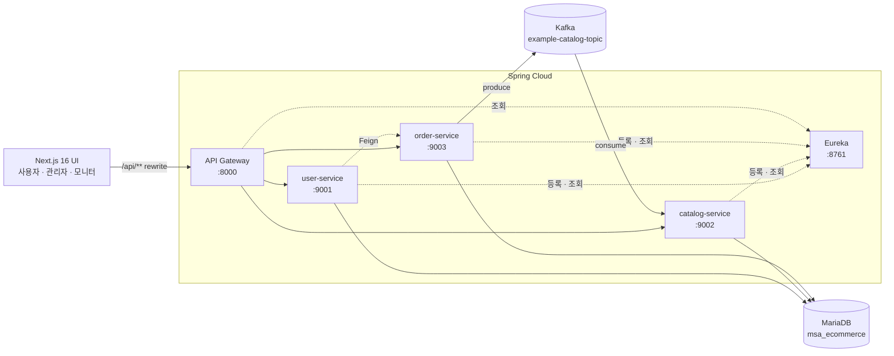
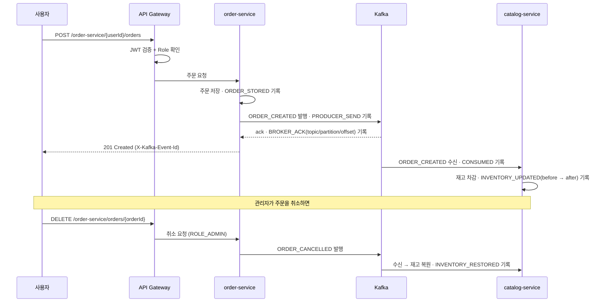

# MSA Market Platform

Spring Cloud 기반 마이크로서비스 E-Commerce 플랫폼입니다.
Kafka 이벤트로 주문과 재고를 동기화하고, **이벤트가 어느 단계까지 처리됐는지 화면에서 추적**할 수 있게 만든 것이 핵심입니다.

`Java 11` `Spring Boot 2.4` `Spring Cloud 2020.0` `Kafka` `MariaDB` `Next.js 16` `ELK`

---

## 프로젝트 출처와 범위

이 프로젝트는 이도원 강사님의 인프런 강의 *Spring Cloud로 개발하는 마이크로서비스 애플리케이션(MSA)* 의
예제 코드([joneconsulting/msa_with_spring_cloud](https://github.com/joneconsulting/msa_with_spring_cloud))를
**학습 출발점으로 삼아**, 아래 항목을 직접 설계하고 구현한 결과물입니다.

| 영역 | 강의 예제 (기반) | 직접 구현 |
|---|---|---|
| 데이터 | H2 인메모리 | MariaDB 영속화, 초기 데이터 시딩 |
| 인증/인가 | JWT 발급 + 게이트웨이에서 토큰 유효성만 확인 | **Role 기반 인가**, 라우트별 권한 분리, 사용자 정보 헤더 전파 |
| Kafka | 주문 → 재고 수량 동기화 예제 | **이벤트 단계별 추적 로그**, **주문 취소 보상 이벤트(재고 복원)** |
| 관측 | 없음 | **Kafka Event Flow Monitor**, System Monitor, ELK 중앙 로그 수집 1차 구성 |
| 화면 | 없음 | **Next.js 16 App Router 기반 사용자/관리자 UI 전체** |

기존 강의 예제 중 현재 플랫폼 실행과 직접 관련 없는 일부 실습 모듈과 교안 자료는 아직 저장소에 남아 있으며, 기능 안정화 후 별도 정리할 예정입니다.

---

## 아키텍처



- 모든 외부 요청은 **API Gateway 단일 진입점**을 통과합니다.
- 서비스 간 위치는 **Eureka**로 해석하고, 게이트웨이는 `lb://` 로 라우팅합니다.
- 주문과 재고는 **동기 호출이 아니라 Kafka 이벤트**로 연결해 서비스 간 결합을 끊었습니다.

---

## 핵심 흐름: 주문 → 재고 차감 → 취소 보상



**이벤트 로그를 남긴 이유** — 비동기 처리는 "요청은 성공했는데 반영이 안 됐다"는 상황을 디버깅하기가 어렵습니다.
그래서 발행 측(`ORDER_STORED → PRODUCER_SEND → BROKER_ACK`)과 소비 측(`CONSUMED → INVENTORY_UPDATED`)의
각 단계를 파티션·오프셋·재고 변화(before → after)와 함께 DB에 적재하고, 화면에서 이벤트 ID로 추적할 수 있게 했습니다.
재고 부족이나 상품 없음 같은 실패는 `CONSUMER_ERROR` 로 남아 원인이 화면에 그대로 보입니다.

---

## 화면

| 스토어 | Kafka Event Flow Monitor | 관리자 콘솔 |
|---|---|---|
| <!-- TODO: docs/screenshot-store.png --> | <!-- TODO: docs/screenshot-kafka.png --> | <!-- TODO: docs/screenshot-admin.png --> |

> 스크린샷은 `docs/` 에 넣고 위 표에 연결하세요. (README에서 제일 먼저 보게 되는 부분입니다)

---

## 인증 / 인가

로그인 시 발급되는 JWT에 `role` 클레임을 담고, **게이트웨이에서 라우트별로 요구 권한을 검사**합니다.
검증을 통과한 요청에는 `X-Auth-User-Id`, `X-Auth-User-Role` 헤더를 게이트웨이에서 덮어써 하위 서비스로 전달합니다. 사용자 상세/주문 API는 하위 서비스에서도 path의 `userId`와 인증 사용자를 다시 대조해 **본인 또는 관리자만 접근**할 수 있게 했습니다.

| 엔드포인트 | 권한 |
|---|---|
| `POST /user-service/login`, `POST /user-service/users` | 공개 |
| `GET /catalog-service/catalogs`, `GET /catalog-service/kafka/events` | 공개 |
| `POST /order-service/{userId}/orders`, `GET /order-service/{userId}/orders` | 로그인 + 본인 또는 관리자 |
| `GET /user-service/users`, `PUT · DELETE /user-service/users/**` | `ROLE_ADMIN` |
| `POST · PUT · DELETE /catalog-service/catalogs/**` | `ROLE_ADMIN` |
| `GET /order-service/orders`, `DELETE /order-service/orders/**` | `ROLE_ADMIN` |

회원가입 시 role은 서버가 `ROLE_USER`로 고정합니다(요청 본문의 role은 무시). `user-service → order-service` Feign 주문 조회는 외부 Gateway Route에 노출하지 않는 `/order-service/internal/{userId}/orders` 내부 경로를 사용합니다.

---

## 실행 방법

### 1. 인프라 기동

```bash
# MariaDB
docker run -d --name msa-mariadb -p 3306:3306 \
  -e MARIADB_ROOT_PASSWORD=root1234 \
  -e MARIADB_DATABASE=msa_ecommerce \
  -e MARIADB_USER=msa -e MARIADB_PASSWORD=msa1234 \
  mariadb:10.11

# Kafka + Zookeeper
docker compose -f docker-files/docker-compose-kafka.yml up -d
```

### 2. 환경 변수

```bash
export JWT_SECRET=$(openssl rand -base64 64 | tr -d '\n')
export DB_PASSWORD=msa1234
```

> `JWT_SECRET`을 지정하지 않으면 로컬 개발용 기본값으로 뜹니다. 공개 환경에서는 반드시 지정하세요.

### 3. 서비스 기동 (순서 중요)

```bash
cd discoveryservice   && ./mvnw spring-boot:run   # :8761
cd apigateway-service && ./mvnw spring-boot:run   # :8000
cd user-service       && ./mvnw spring-boot:run   # :9001
cd catalog-service    && ./mvnw spring-boot:run   # :9002
cd order-service      && ./mvnw spring-boot:run   # :9003
```

### 4. 프론트엔드

```bash
cd msa-react-test-ui
cp .env.local.example .env.local
npm install
npm run dev            # http://localhost:3000
```

### 5. 테스트 계정

| 계정 | 비밀번호 | 권한 |
|---|---|---|
| `admin@test.com` | `admin1234` | `ROLE_ADMIN` |
| `test@test.com` | `test1234` | `ROLE_USER` |

### 6. (선택) ELK 중앙 로그 수집 1차 구성

```bash
docker compose -f infrastructure/elk/docker-compose-elk.yml up -d
# Kibana: http://localhost:5601
```

---

## 프로젝트 구조

```
.
├── discoveryservice/       Eureka 서버
├── apigateway-service/     Spring Cloud Gateway · JWT 인가 필터
├── user-service/           회원 · 로그인 · JWT 발급 · Feign(주문 조회)
├── catalog-service/        상품 · Kafka Consumer · 이벤트 로그 API
├── order-service/          주문 · Kafka Producer · 이벤트 로그
├── config-service/         Spring Cloud Config (선택)
├── msa-react-test-ui/      Next.js 16 App Router UI
├── infrastructure/elk/     Elasticsearch · Logstash · Kibana · Filebeat
└── docker-files/           Kafka · MariaDB compose
```

---

## 상세 문서

- [개발자 가이드](./MSA_MARKET_PLATFORM_DEVELOPER_GUIDE.md) — 서비스별 설계, 구현 중 만난 문제와 해결 과정
- [Docker 인프라 실행 가이드](./MSA_MARKET_PLATFORM_DOCKER_INFRASTRUCTURE_GUIDE.md) — 컨테이너 구성 상세

---

## 알려진 한계와 다음 단계

솔직하게 남겨둡니다. 포트폴리오 목적상 "다 했다"보다 "어디까지 했고 왜 그렇게 뒀는지"가 더 중요하다고 봤습니다.

현재 `user-service → order-service` Feign 조회에는 **Resilience4J Circuit Breaker + fallback(빈 주문 목록)** 이 실제 적용되어 있습니다.

- [ ] **Spring Boot 3.x / Java 17 마이그레이션** — 현재 2.4.2 기반. `javax → jakarta`, Security 설정 방식 변경, jjwt 0.12 API 대응이 필요합니다.
- [ ] **테스트 코드** — Kafka 재고 차감/복원/재고부족 시나리오부터 작성 예정.
- [ ] **Consumer 멱등성** — 동일 이벤트 재소비 시 재고가 중복 반영될 수 있습니다. `eventId` 유니크 제약으로 방어할 계획입니다.
- [ ] **`docker compose up` 원샷 기동** — 현재는 서비스를 개별 실행해야 합니다.
- [ ] **하위 서비스 직접 호출 차단** — 게이트웨이를 우회한 직접 호출을 네트워크/IP 레벨에서 막아야 합니다.
